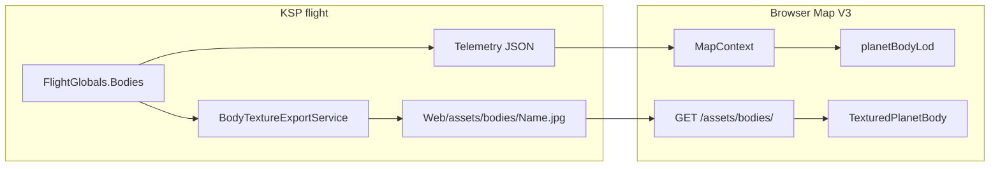

# Map V3 — Phase 3 guide (planet bodies + textures + orientation)

**Audience:** Operators testing in KSP, and developers extending Map V3.  
**Status:** Phase 3.1 (mesh/icon bodies) + Phase 3.3 (textures) + Phase 3.4 (tilt/spin) — **complete** (see [`MAP_V3_PROGRAM_STATE.md`](MAP_V3_PROGRAM_STATE.md)).  
**UI build:** `112-planet-texture-flipy` — hard-refresh `http://127.0.0.1:8750/?v=112`

| Doc | Role |
|-----|------|
| **This guide** | How-to, workflows, troubleshooting |
| [`MAP_V3_PLANET_BODY_SPEC.md`](MAP_V3_PLANET_BODY_SPEC.md) | Formal body element spec (LOD, position) |
| [`MAP_V3_PLANET_BODY_TEXTURE_SPEC.md`](MAP_V3_PLANET_BODY_TEXTURE_SPEC.md) | Formal texture export spec (plugin + HTTP) |
| [`MAP_V3_PLANET_BODY_ORIENTATION_SPEC.md`](MAP_V3_PLANET_BODY_ORIENTATION_SPEC.md) | Formal tilt/spin spec (schema v10) |
| [`MAP_V3_ACCEPTANCE.md`](MAP_V3_ACCEPTANCE.md) | Pass/fail checklists P3-xx, P3T-xx, P3R-xx |
| [`web/dev/README.md`](../web/dev/README.md) | Planet texture lab only |

---

## 1. What Phase 3 delivers

Phase 3 adds **heliocentric planet markers** on top of Phase 1 (Sun) and Phase 2 (orbit rings):

| Feature | Zoomed out | Zoomed in (mesh LOD) |
|---------|------------|----------------------|
| **Position** | On the colored orbit ring (same authority as trails) | Same |
| **Appearance** | Fixed-size **round dot**, orbit color | **Sphere** at physical scale |
| **Texture (3.3)** | Dots stay **flat color** (no JPEG) | **Exported ScaledSpace JPEG** from the plugin |
| **Orientation (3.4)** | Dots **not** rotated | Mesh rotates with `body.rotation` at game UT |

Moons, vessels, labels, and SOI are **not** Phase 3 — see [`MAP_V3_MODULES.md`](MAP_V3_MODULES.md).



---

## 2. Prerequisites

| Requirement | Notes |
|-------------|-------|
| KSP 1.12.3 + matching mod DLL | Built with `scripts/build.ps1`, installed with `scripts/install.ps1` |
| `KSP_ROOT` set | Required for DLL build |
| Node.js + `npm` | For web bundle (`web/npm run build`) |
| Flight save loaded | Texture export runs in **flight**, not main menu |
| Web map | View → **3D Map V3** (`3d-v3`) |

---

## 3. Quick start (operator)

1. **Build and install** (see §8).
2. Start KSP, **load a flight** (any stock system save).
3. Wait a few seconds — KSP log should show `[KspWebMap] body texture Kerbin: ready` (and other planets).
4. Open **`http://127.0.0.1:8750/?v=112`** (Ctrl+F5).
5. Choose **View → 3D Map V3**, click **Recenter**.
6. **Zoom in** on Kerbin (or any planet) until the dot becomes a **sphere** — you should see the exported surface texture.
7. **Zoom out** — planets return to **small colored dots** on their orbit lines.

**HUD:** `v3 phase 3.4 — planet tilt and spin`  
**Console:** `[KspWebMap] UI 112-planet-texture-flipy`

---

## 4. How a planet appears on the map

You do **not** register planets manually in the web UI. Inclusion is **automatic** from telemetry.

### 4.1 Which bodies count as “planet”

A body is drawn when **all** of the following hold:

| Rule | Source |
|------|--------|
| Listed in `hierarchy.planetNames` | Built from `telemetry.bodies[]` parent chain |
| Not the root body (Sun) | `name !== rootBody` |
| Has `positionRootRelativeMeters` | Valid snapshot |
| Visible in moon-LOD filter | `visibleBodyNames` (same as orbits) |

**Heliocentric rule (DLL + web):** `orbit.referenceBody === Sun` (root). Moons (parent = Kerbin, etc.) are **excluded**.

**Modded star systems:** Any body the DLL treats as a direct child of `rootBody` in the hierarchy is included — no hardcoded stock name list in the web planner.

### 4.2 Pipeline (code path)

```text
telemetry.bodies[]
  → buildMapContext() → hierarchy.planetNames, bodyByName
  → buildPlanetBodySegments() → one segment per planet (position point)
  → PlanetBodyLayer → PlanetBodyMesh
       → resolvePlanetBodyDrawMode() → "icon" | "mesh"
       → icon: PlanetBodyDot
       → mesh: PlanetBodyOrientedGroup → PlanetBodyMeshPoleFrame → TexturedPlanetBody | FlatPlanetBody
```

**Files:** [`web/src/map-v3/elements/planetBody/buildPlanetBodySegments.ts`](../web/src/map-v3/elements/planetBody/buildPlanetBodySegments.ts), [`web/src/scene/v3/layers/PlanetBodyLayer.tsx`](../web/src/scene/v3/layers/PlanetBodyLayer.tsx)

### 4.3 Adding a “new planet” (mod / custom system)

**In KSP:** Install the planet mod; load a save where that body orbits the Sun.

**In the mod repo:** Usually **no web change** — if telemetry lists the body as a Sun child with position + radius, it appears automatically.

**Optional — orbit/body color:** Add an entry in [`web/src/scene/kspBodyMapColorTable.ts`](../web/src/scene/kspBodyMapColorTable.ts) or use **Customize Map** dev HUD ([`PLANET_ORBIT_COLOR_GUIDE.md`](PLANET_ORBIT_COLOR_GUIDE.md)). Unknown bodies get a default grey.

**Future — manual inclusion override:** Not implemented; do not hardcode body name lists in V3 planners ([`MAP_V3_DECOUPLE_PLAN.md`](MAP_V3_DECOUPLE_PLAN.md)).

---

## 5. Mesh vs icon (LOD)

Controlled by [`planetBodyLod.ts`](../web/src/map-v3/elements/planetBody/planetBodyLod.ts) (always on in V3; no separate layer flag).

| Mode | When | Visual |
|------|------|--------|
| **icon** | Projected mesh diameter ≤ **7 px** on screen | Round dot, orbit color, fixed screen size |
| **mesh** | Projected mesh diameter **> 7 px** | 3D sphere, radius from `bodyMeshRadius` |

**Dev override:** Customize Map → planet body LOD panel (`devPlanetBodyLodOverride`: auto / force icon / force mesh).

**Crossover tuning:** `PLANET_BODY_DOT_PIXEL_SIZE` in `planetBodyLod.ts`.

---

## 6. Planet textures (Phase 3.3)

### 6.1 Overview

Textures are **not** bundled in git (Squad/mod license). The **plugin exports** them at flight load from each planet’s in-game **ScaledSpace** material, then the **browser loads** them over HTTP when drawing **mesh LOD only**.

### 6.2 Export (automatic in KSP)

| Step | What happens |
|------|----------------|
| 1 | Flight loads → `BodyTextureExportService` starts |
| 2 | One planet per frame → read `CelestialBody.scaledBody` material |
| 3 | Blit albedo → resize max 1024 → JPEG quality 85 |
| 4 | Write `GameData/KspWebMap/Web/assets/bodies/{BodyName}.jpg` |
| 5 | Write `{BodyName}.jpg.meta` (material fingerprint for invalidation) |

**Re-export:** Only if fingerprint changes (texture mod) or JPEG missing — not every telemetry tick.

**Log examples:**

```text
[KspWebMap] body texture Kerbin: ready (42ms).
[KspWebMap] body texture export finished in 2.31s for 8 planets.
```

**DLL sources:** [`src/KspWebMap/Textures/ScaledBodyTextureExporter.cs`](../src/KspWebMap/Textures/ScaledBodyTextureExporter.cs), [`src/KspWebMap/Services/BodyTextureExportService.cs`](../src/KspWebMap/Services/BodyTextureExportService.cs)

### 6.3 On-disk layout (local only, gitignored)

```text
GameData/KspWebMap/Web/assets/bodies/
  Kerbin.jpg
  Kerbin.jpg.meta
  Duna.jpg
  ...
  README.md          ← committed (instructions only)
  .gitkeep           ← committed
```

See [`GameData/KspWebMap/Web/assets/bodies/README.md`](../GameData/KspWebMap/Web/assets/bodies/README.md).

### 6.4 Telemetry fields (schema v9+)

Texture fields ship with schema **v9**; orientation fields require schema **v10** (same flight DLL). On each **heliocentric planet** in `bodies[]`:

| Field | Example | Meaning |
|-------|---------|---------|
| `bodyTextureStatus` | `ready` | `pending` \| `ready` \| `failed` \| `unsupported` |
| `bodyTextureUrl` | `/assets/bodies/Kerbin.jpg?rev=4f6cdfba` | Browser load path (+ cache bust) |
| `bodyTextureRevision` | `4f6cdfba` | Hash of JPEG bytes |

**Check:** `http://127.0.0.1:8750/api/telemetry` → find `Kerbin` under `bodies[]`.

**Script:** `scripts/verify-telemetry.ps1` prints a texture status table for Sun-child planets.

### 6.5 How the web loads a texture on a planet

Automatic when **both** are true:

1. **LOD** = `mesh` (zoomed in enough).
2. **`bodyTextureStatus === "ready"`** and `bodyTextureUrl` is set.

**Flow:**

```text
PlanetBodyLayer passes bodyTexture* from telemetry
  → PlanetBodyMesh
       → isPlanetBodyTextureReady() ?
            yes → TexturedPlanetBody
              → loadBodyTexture(url, revision)
              → MeshBasicMaterial (map + white color, toneMapped: false)
            no  → FlatPlanetBody (orbit color sphere)
```

**Loader:** [`web/src/assets/planetBodyTextures.ts`](../web/src/assets/planetBodyTextures.ts) — cache keyed by URL + revision; **`flipY = true`** so north/south matches Three `SphereGeometry` + KSP JPEG layout (Three’s default `flipY = true` is wrong for exported maps).

**Material:** `TexturedPlanetBody` uses a stable `THREE.MeshBasicMaterial` updated in code (`material.map = texture`) and `<primitive attach="material" />` — required for React Three Fiber.

**Important:** Icon LOD **never** loads JPEGs (by design).

### 6.6 Manual checks (no DevTools required)

| Check | URL / action |
|-------|----------------|
| JPEG exists | Open `http://127.0.0.1:8750/assets/bodies/Kerbin.jpg` in browser |
| Telemetry | `http://127.0.0.1:8750/api/telemetry` — `bodyTextureStatus: "ready"` |
| Lab isolate | `http://127.0.0.1:8750/planet-texture-lab.html?textureUrl=/assets/bodies/Kerbin.jpg` |
| UI version | Browser console: `112-planet-texture-flipy` |

---

## 7. Planet texture lab (developer tool)

Isolated full-screen sphere for testing **texture binding** without the full dashboard. **Not** part of `ksp-solar-map.js` (separate `planet-texture-lab.js` entry).

| Environment | URL |
|-------------|-----|
| **In-game HTTP** | `http://127.0.0.1:8750/planet-texture-lab.html?textureUrl=/assets/bodies/Kerbin.jpg` |
| **Vite dev** | `npx vite web/dev/planet-texture-lab.html` (proxies `/assets/bodies` to :8750 if KSP running) |

**Query params:**

| Param | Default | Purpose |
|-------|---------|---------|
| `textureUrl` | `/assets/bodies/Kerbin.jpg` | Path to JPEG |
| `rev` | (none) | Must match telemetry revision to test cache bust |

**Expected:**

| Look | Meaning |
|------|---------|
| Blue/green Kerbin | OK |
| Teal sphere | Loading / no URL |
| Flat white | Map not bound (regression) |
| Flat orbit color | Fallback (`status` not `ready`) |

Full detail: [`web/dev/README.md`](../web/dev/README.md).

### 7.5 Planet tilt and spin (Phase 3.4)

**Spec:** [`MAP_V3_PLANET_BODY_ORIENTATION_SPEC.md`](MAP_V3_PLANET_BODY_ORIENTATION_SPEC.md)

| Item | Detail |
|------|--------|
| DLL capture | `body.rotation` + `angularVelocity` mapped to **root-relative** frame (same as positions) via [`OrbitFrameMapping.cs`](../src/KspWebMap/Telemetry/OrbitFrameMapping.cs) |
| Telemetry | Schema **v10** — `bodyOrientationRootRelative`, `spinAxisRootRelative`, `angularVelocityRootRelativeRadPerSec`, `rotationAngleRadians` |
| Web | `PlanetBodyOrientedGroup` applies `kspRootQuaternionToThree`; UT extrapolation between 0.2 s polls |
| Pole frame | `PlanetBodyMeshPoleFrame` — −90° X so sphere texture pole aligns with KSP body north in Three body basis |
| Icon LOD | No rotation (dots unchanged) |
| Dev HUD | **Show spin/tilt axis** (Customize Map area) — yellow line through mesh poles |

**Operator check:** Same flight and UT — compare obliquity on Moho/Eve/Jool; spin axis line should pass through visible poles. **Longitude** vs KSP tracking map may still be off by a fixed offset (see §13) — not a spin-rate bug.

**Lab:** `planet-texture-lab.html?orientation=telemetry&body=Kerbin` (requires schema v10 DLL).

**Verify script:** `scripts/verify-telemetry.ps1` prints orientation table when schema v10 is live.

---

## 8. Build and install

### 8.1 One-shot (recommended)

```powershell
$env:KSP_ROOT = "C:\Path\To\Kerbal Space Program"
.\scripts\build.ps1
.\scripts\install.ps1
```

This builds the DLL, runs `npm run build`, copies web assets + `planet-texture-lab.html` into `GameData/KspWebMap/`.

### 8.2 Web-only refresh

```powershell
cd web
npm run build
```

Copy `web/dist/assets/*` → `GameData/KspWebMap/Web/assets/` in your KSP install, and bump `?v=` in `index.html` if needed.

### 8.3 After install

1. Restart KSP (or reload flight) so the new DLL loads.
2. Hard-refresh browser (`?v=112`).

---

## 9. Verification

### 9.1 Automated

```powershell
cd web
npm test          # 106+ tests including planetBodyLod, textures, orientation
npm run build

.\scripts\verify-telemetry.ps1   # KSP running, flight loaded
```

### 9.2 Manual acceptance

| Section | Doc |
|---------|-----|
| Bodies + LOD | [`MAP_V3_ACCEPTANCE.md`](MAP_V3_ACCEPTANCE.md) § Phase 3.1 (P3-01–P3-14) |
| Textures | [`MAP_V3_ACCEPTANCE.md`](MAP_V3_ACCEPTANCE.md) § Phase 3.3 (P3T-01–P3T-10) |
| Tilt / spin | [`MAP_V3_ACCEPTANCE.md`](MAP_V3_ACCEPTANCE.md) § Phase 3.4 (P3R-01–P3R-10) |

### 9.3 Side-by-side with KSP

Use KSP **map view** vs web **3D Map V3** on the same flight: planet on ring, zoom icon↔mesh, mesh texture vs tracking map ScaledSpace.

---

## 10. Troubleshooting

| Symptom | Likely cause | Fix |
|---------|--------------|-----|
| No planets at all | Phase 0–2 only / wrong view | View → **3D Map V3**; check `MAP_V3_LAYERS_PHASE3` |
| Dots only, never mesh | Zoomed out | Zoom in on planet; or dev HUD → force mesh |
| Mesh but flat **color** only | Textures not exported or `status` not `ready` | Load flight; check log + `/api/telemetry` |
| Mesh **white** sphere | Map not bound in R3F | Hard refresh `?v=112`; use `TexturedPlanetBody` primitive material pattern |
| Mesh **black** sphere | Old bundle (map-only material bug) | Hard refresh `?v=107` or newer |
| Texture upside-down | Wrong `flipY` | Current build uses `flipY = true` in `planetBodyTextures.ts` |
| Texture rotated ~20° vs KSP map | UV meridian vs KSP mesh (known) | Deferred — §13; spin/obliquity can still be correct |
| `bodyTextureStatus: pending` | Export still running | Wait ~5 s after flight load |
| `failed` / `unsupported` | Exotic shader / no `_MainTex` | Color fallback; check KSP log for body name |
| JPEG 404 | No flight export yet | Load flight first |
| Stale texture after mod | Fingerprint / revision | Reload flight; URL `?rev=` should change |
| Kerbin square icon | Wrong LOD branch | Should be round dot — report bug |
| Mun has “planet” mesh | Should not happen | Excluded by hierarchy — report bug |

---

## 11. Developer reference (files)

### 11.1 Planner + policy (`map-v3`)

| File | Purpose |
|------|---------|
| `elements/planetBody/buildPlanetBodySegments.ts` | One segment per planet |
| `elements/planetBody/planetBodyLod.ts` | Mesh ↔ icon policy |
| `elements/planetBody/planetBodyTextureFields.ts` | Telemetry texture helpers |
| `elements/planetBody/planetBodyOrientationFields.ts` | UT extrapolation + orientation read |
| `layerFlags.ts` | `MAP_V3_LAYERS_PHASE3` |
| `MapComposer.ts` | Layer list for phase 3 |

### 11.2 Presentation (`scene/v3`)

| File | Purpose |
|------|---------|
| `layers/PlanetBodyLayer.tsx` | Visibility + segment loop |
| `layers/PlanetBodyMesh.tsx` | LOD router + oriented mesh |
| `layers/PlanetBodyOrientedGroup.tsx` | Attitude quaternion (production: UT only; lab: optional frame spin) |
| `layers/PlanetBodyMeshPoleFrame.tsx` | Sphere pole ↔ KSP north |
| `layers/PlanetBodySpinAxisLine.tsx` | Dev spin/tilt axis |
| `layers/PlanetBodyDot.tsx` | Icon LOD |
| `coords/kspBodyOrientation.ts` | KSP ↔ Three basis + world→root mapping |
| `layers/TexturedPlanetBody.tsx` | Textured mesh |
| `layers/FlatPlanetBody.tsx` | Color fallback mesh |
| `layers/usePlanetBodyDrawMode.ts` | Per-frame LOD from camera |

### 11.3 Assets + dev

| File | Purpose |
|------|---------|
| `assets/planetBodyTextures.ts` | Loader + cache |
| `dev/PlanetTextureLab.tsx` | Lab UI |
| `dev/planet-texture-lab-entry.tsx` | Lab bundle entry |

### 11.4 Plugin (C#)

| File | Purpose |
|------|---------|
| `Textures/ScaledBodyTextureExporter.cs` | JPEG export |
| `Services/BodyTextureExportService.cs` | Flight-load queue |
| `Textures/HeliocentricPlanetFilter.cs` | Sun-child filter |
| `Telemetry/CelestialBodySnapshot.cs` | `bodyTexture*` + orientation fields |
| `Telemetry/BodyOrientationResolver.cs` | `body.rotation` → root-relative quaternion |
| `Telemetry/OrbitFrameMapping.cs` | World → root-relative (positions + orientation) |
| `Services/LocalHttpServerService.cs` | Serves `/assets/bodies/` |

### 11.5 Pattern for Phase 4–5 (moons)

Copy the same **split**:

1. Element builder under `map-v3/elements/moonBody/` (planner only).
2. LOD policy file (can share `planetBodyLod` math later).
3. Layer under `scene/v3/layers/MoonBodyLayer.tsx`.
4. Textures: only if moons get export rules in DLL (not Phase 3).

---

## 12. Dev HUD summary

| Panel | Control | Effect |
|-------|---------|--------|
| Planet body LOD | Auto / force dot / force mesh | Overrides `planetBodyLod` crossover |
| Planet orientation | **Show spin/tilt axis** | Yellow pole line (mesh LOD only, 3d-v3) |
| Customize Map | Orbit color pick, etc. | Phase 2 colors — unchanged |

---

## 13. Lessons learned (remember for Phase 4+)

These came from Phase 3 implementation and V&V. **Do not repeat these mistakes** on moons or vessels.

### Frames and coordinates

| Lesson | Detail |
|--------|--------|
| **One frame for position + orientation** | Heliocentric bodies use root-relative axes from `getRelativePositionAtUT` / `OrbitFrameMapping`. Raw Unity `body.rotation` without mapping caused spin axis and orbit plane to disagree. See [`HELIOCENTRIC_ORBIT_FRAME.md`](HELIOCENTRIC_ORBIT_FRAME.md). |
| **Three.js is a display basis only** | `kspRootQuaternionToThree` is `Q_three = M · Q_ksp · M⁻¹`. Never mix KSP vectors with Three quaternions without `M`. |
| **Do not infer obliquity from ω vs orbit normal in mixed frames** | Stock planets can look “90° tilted” if world ω is compared to root-relative positions — that was a frame bug, not Squad physics. |

### Textures

| Lesson | Detail |
|--------|--------|
| **Export ≠ unwrap** | JPEG is flat `_MainTex` from ScaledSpace material, not a render of KSP’s mesh. Web uses generic `SphereGeometry` UVs — expect a **fixed longitude offset** until `phiStart` or export-time meridian metadata exists. |
| **`flipY` matters** | KSP/Unity exports need `texture.flipY = true` on Three loader for correct north/south on the sphere. |
| **R3F material binding** | Declaring `<meshBasicMaterial map={texture} />` often fails in CEF; mutate `material.map` and use `<primitive attach="material" />`. |
| **Icon LOD never textures** | By design — saves HTTP and keeps dots readable. |

### Orientation and spin

| Lesson | Detail |
|--------|--------|
| **Texture does not scroll** | Only the parent group rotates; JPEG is static. Longitude alignment is quaternion + UV seam, not `texture.offset`. |
| **Do not tie spin sign to UV mirror** | DLL export **flip-X** (`BodyTextureExportLayout` `v2-flipx-uv`); web `BODY_TEXTURE_MIRROR_U=false`. Mesh spin = telemetry ω̂ only (`127`+). Re-export textures after layout bump. |
| **Pole frame is separate from attitude** | `PlanetBodyMeshPoleFrame` aligns mesh +Y with KSP north in body basis; `PlanetBodyOrientedGroup` applies spin/tilt. |
| **No double spin** | Production map must not combine UT extrapolation with per-frame `useFrame` spin on the same mesh. Lab uses `frameSpin` only in isolation. |
| **Quaternion multiply order** | Inertial spin step uses **pre-multiply** in lab; production uses snapshot + UT delta only. |
| **Stock map orbit line vanishes when zoomed** | Cannot use in-game prograde tick for texture V&V; use web dev axis, texture lab, or deferred subsolar overlay. |

### Architecture

| Lesson | Detail |
|--------|--------|
| **Planner vs presentation** | `buildPlanetBodySegments` = positions only; LOD/texture/orientation live in `PlanetBodyMesh` stack. Copy for `moonBody`. |
| **Single inclusion gate in DLL** | `HeliocentricPlanetFilter` for textures and orientation — moons need their own filter. |
| **Lab off main bundle** | `planet-texture-lab` is a separate Vite entry — keeps `ksp-solar-map.js` smaller. |
| **Phase 3 closed, P3R-01 partial OK** | Ship moon orbits before perfect Kerbin longitude; document meridian debt in program state. |

---

## 14. Related specs and revision history

| Rev | Date | Change |
|-----|------|--------|
| 1.0 | 2026-05-22 | Phase 3 operator + developer guide (bodies 3.1, textures 3.3, lab) |
| 1.1 | 2026-05-23 | Phase 3.4 tilt/spin; schema v10 |
| 1.2 | 2026-05-23 | Phase 3 closeout: UI v112, flipY, pole frame, lessons §13, known meridian debt |

Formal IDs: [`MAP_V3_PLANET_BODY_SPEC.md`](MAP_V3_PLANET_BODY_SPEC.md), [`MAP_V3_PLANET_BODY_TEXTURE_SPEC.md`](MAP_V3_PLANET_BODY_TEXTURE_SPEC.md), [`MAP_V3_PLANET_BODY_ORIENTATION_SPEC.md`](MAP_V3_PLANET_BODY_ORIENTATION_SPEC.md).
