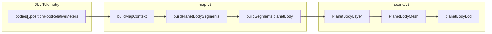

# Map V3 — Planet body markers (element specification)

| Field | Value |
|-------|-------|
| **Document ID** | MAP-V3-PLANET-BODY-001 |
| **Revision** | 1.2 (2026-05-23) |
| **Phase** | 3.1 (`planetBody`) + 3.3 textures + 3.4 orientation (mesh LOD) |
| **Scope** | Heliocentric **planet** position markers: mesh/icon LOD; textures + attitude per sibling specs |
| **UI build** | `112-planet-texture-flipy` (`?v=112`) |
| **Depends on** | Phase 1 `starMarker`, Phase 2 `planetOrbit` (alignment reference) |

## References

| Source | Role |
|--------|------|
| KSP tracking map | Icon size, zoom transition, body-on-trail placement |
| [`MAP_V3_PLANET_ORBIT_SPEC.md`](MAP_V3_PLANET_ORBIT_SPEC.md) | Sister element; shared visibility and color |
| [`BODY_ORBIT_VNV.md`](BODY_ORBIT_VNV.md) | AC-009 icon↔trail₀; position authority |
| [`HELIOCENTRIC_ORBIT_FRAME.md`](HELIOCENTRIC_ORBIT_FRAME.md) | Sun-child positions; no web frame hacks |
| [`MAP_V3_DECOUPLE_PLAN.md`](MAP_V3_DECOUPLE_PLAN.md) | V3 must not import v2 planner |
| [`PLANET_ORBIT_COLOR_GUIDE.md`](PLANET_ORBIT_COLOR_GUIDE.md) | Color resolution (orbits + bodies) |
| [`MAP_V3_RENDERING_GUIDE.md`](MAP_V3_RENDERING_GUIDE.md) | Living § Planet body summary |
| [`MAP_V3_PLANET_BODY_TEXTURE_SPEC.md`](MAP_V3_PLANET_BODY_TEXTURE_SPEC.md) | Phase 3.3 mesh LOD textures (plugin export) |
| [`MAP_V3_PLANET_BODY_ORIENTATION_SPEC.md`](MAP_V3_PLANET_BODY_ORIENTATION_SPEC.md) | Phase 3.4 mesh LOD tilt and spin (schema v10) |
| [`MAP_V3_PHASE3_GUIDE.md`](MAP_V3_PHASE3_GUIDE.md) | Operator + developer how-to |
| V2 `PlanetBodyLayer` / `BodyMeshV2` | **Reference only** — not imported by V3 |

## Purpose and KSP reference behavior

**Objective:** Render each stock heliocentric planet at its display-authority position on the Phase 2 orbit ring, matching the KSP tracking map convention:

- **Zoomed in:** body appears as a **sphere** scaled to physical radius in the solar-system view (within scene scale limits).
- **Zoomed out:** body becomes a **fixed-size colored dot** so it does not shrink to invisibility.
- **Transition:** swap to icon when the mesh would be **too small on screen**; at crossover the mesh’s projected size is below the fixed icon’s projected size (see § Visual scale and LOD).

### Out of scope (explicit deferrals)

| Item | Phase |
|------|-------|
| Moons | 4–5 (`moonOrbit`, `moonBody`) |
| Sun mesh | 1 (`starMarker` only) |
| Vessel marker | 6 |
| SOI rings | 11 |
| Body labels | 9 |
| Picking / selection highlight | 12 |
| Focus emissive glow (v2 blue) | Deferred |
| *(shipped)* ScaledSpace JPEG on mesh LOD | Phase 3.3 — [`MAP_V3_PLANET_BODY_TEXTURE_SPEC.md`](MAP_V3_PLANET_BODY_TEXTURE_SPEC.md) |
| Separate `bodyLod` flag / `BodyLodLayer` | Phase 7 generalization |
| Web-side inclination / plane “fixes” | **Forbidden** |

## Inclusion rules

| Body class | Included when | Segment builder | Layer filter |
|------------|---------------|-----------------|--------------|
| **Planet (heliocentric)** | `name ∈ hierarchy.planetNames` and `name ≠ ctx.rootBody` and entry in `bodyByName` | `buildPlanetBodySegments` | `visibleBodyNames` ∩ `planetNames` |
| **Root / Sun** | Never (star marker) | Excluded in builder | — |
| **Moon** | Never | — | — |
| **Vessel** | Never | — | — |
| **Mod planet** | Same rules if in telemetry hierarchy as planet child of root | Same | Same |

V3 lists planets from `hierarchy.planetNames`, not `bodyOrbitPaths[]`. No `map-v2/TrajectoryPlanner` import in production code ([`MAP_V3_DECOUPLE_PLAN.md`](MAP_V3_DECOUPLE_PLAN.md)).

**Parity:** Body name set must match legacy v2 `BodyPosition` + `planetOnly` on golden fixture (`web/src/map-v3/elements/planetBody/buildPlanetBodySegments.test.ts`).

**No** hardcoded stock body name lists for geometry — use `hierarchy.planetNames` from telemetry-derived hierarchy.

## Position and frame authority (non-negotiable)

### Display authority

| Quantity | Source |
|----------|--------|
| Segment point | `MapContext.bodyByName.get(name).position` |
| Telemetry field | `bodies[].positionRootRelativeMeters` at `gameUniversalTimeSeconds` |
| DLL resolver | `GetBodyDisplayRootRelative` (= trail sample resolver) |

**Requirement P3-FRAME-01:** Planet mesh/icon center must coincide with Phase 2 trail anchor within [`BODY_ORBIT_VNV.md`](BODY_ORBIT_VNV.md) thresholds (`iconTrailSample0ResidualMeters ≤ 1 m`, `liveToSample0Meters ≤ 1 m` on stable flight).

### Scene mapping

```text
rootPoint (meters) → toScenePoint(rootPoint, sceneFrame) → [x, y, z] scene units
```

- Planets/orbits: **normal** `sceneFrame` from `MapV3Provider` (moon LOD world shift applies).
- Star: `starMarkerDrawFrame(sceneFrame)` — unshifted when `focus == null` (full system); **same shift as bodies** when `focus` is set (body focus / SOI), so the Sun stays at heliocentric origin and does not stack on the focused planet.
- **Do not** use `starMarkerSceneFrame` for drawing when `displayFocus` is active (camera bounds for star-only view still use it).

**Requirement P3-FRAME-02:** No web-side inclination flip, orbit-plane rotation, or trail-phase offset applied to body position.

## Visual scale and LOD (normative math)

### Scene mesh radius

Shared function `bodyMeshRadius` in `web/src/scene/bodyVisualScale.ts` (not duplicated in V3):

```text
physical = max(radiusMeters, 1000) × displayScale

IF bodyName = rootBody OR "Sun":
  meshR = max(physical, SUN_MIN_MESH_RADIUS)     // 2 — not used for planets

IF isMoon:
  meshR = physical                               // N/A this phase

IF NOT hostPlanetOpen:
  meshR = max(physical, PLANET_SOLAR_MIN_MESH_RADIUS)   // 0.05

ELSE hostPlanetOpen:
  meshR = physical
```

| Constant | Value | Meaning |
|----------|-------|---------|
| `PLANET_SOLAR_MIN_MESH_RADIUS` | 0.05 scene units | Solar-overview floor so planets are not invisible before LOD |
| `hostPlanetOpen` | from `MoonVisibilityContext` via `MapV3Context` | True when host-planet / SOI context open — **true physical scale** |

**Requirement P3-SCALE-01:** Full-system view uses solar floor; host-open uses physical scale.

### LOD decision (V3-owned)

Module: `web/src/map-v3/elements/planetBody/planetBodyLod.ts` — **always enabled** in `PlanetBodyLayer`; **`bodyLod` layer flag ignored**.

```text
camDist = ||camera.position - scenePosition||_3
meshDiameterPx = perspectiveProject(2 * meshR, camDist, camera.fov, viewport.height)

IF meshDiameterPx <= PLANET_BODY_DOT_PIXEL_SIZE (7):
  drawMode = "icon"   (fixed-screen dot, orbit color, no mesh)
ELSE:
  drawMode = "mesh"
```

Recomputed **every frame** in `usePlanetBodyDrawMode` (camera dolly does not re-render React).

| Constant | Value |
|----------|-------|
| `PLANET_BODY_DOT_PIXEL_SIZE` | 7 px (`PointsMaterial`, `sizeAttenuation: false`) |

**Requirement P3-LOD-01:** The map **dot** does not resize with zoom (constant pixel size). When the body **mesh** would appear smaller on screen than the dot, show the dot; when the mesh would appear larger, show the mesh.

**Note:** Direct rule `meshR < dotR` in scene units is **incorrect** for zoom (distance cancels); compare projected pixel diameters.

**Requirement P3-LOD-02:** Constants may be revised after side-by-side KSP map comparison; document rev history when changed.

### Primitives and draw order

| Mode | Geometry | Material (rev 1.0) | `renderOrder` |
|------|----------|-------------------|---------------|
| mesh | `sphereGeometry(meshR, 32, 32)` | `meshBasicMaterial(color)` or Kerbin texture PoC | 1 |
| icon | `Points` (1 vertex) | `pointsMaterial` orbit color, fixed px size | 2 |

Textures, `meshStandardMaterial`, lighting response: **future revision**.

## Data pipeline



1. **Telemetry** → `buildMapContext(telemetry)` → `bodyByName`, `hierarchy.planetNames`.
2. **Planner** → `buildPlanetBodySegments(ctx)` → `TrajectorySegment[]` with `kind: planetBody`, one point per planet.
3. **Layer** → filter `layers.planetBody`, `canDraw`, `visibleBodyNames`, `planetNames`.
4. **Mesh** → `bodyMeshRadius` → `toScenePoint` → `resolvePlanetBodyDrawMode` → R3F `mesh`.

Register in `web/src/map-v3/planner/buildSegments.ts` case `"planetBody"`.

## Color

**Requirement P3-COLOR-01:** Body fill color must use the **same resolution order** as heliocentric planet orbit lines (`web/src/scene/bodyMapColors.ts` `useKspBodyMapColor`):

| Priority | Source |
|----------|--------|
| 1 | Customize Map preview override (dev on, selected body) |
| 2 | Saved default (`localStorage`) |
| 3 | `KSP_BODY_MAP_COLORS` in `kspBodyMapColorTable.ts` |
| 4 | `DEFAULT_BODY_MAP_COLOR` |

Orbit and body for the same `bodyName` must match hue in flight.

Guide: [`PLANET_ORBIT_COLOR_GUIDE.md`](PLANET_ORBIT_COLOR_GUIDE.md)

## V3 decouple and module ownership

| Path | Ownership |
|------|-----------|
| `map-v3/elements/planetBody/buildPlanetBodySegments.ts` | Segment data |
| `map-v3/elements/planetBody/planetBodyLod.ts` | LOD policy (V3-only) |
| `scene/v3/layers/PlanetBodyLayer.tsx` | Composition + visibility |
| `scene/v3/layers/PlanetBodyMesh.tsx` | Per-body R3F primitive |
| `scene/bodyVisualScale.ts` | Shared scale (star + planets) |
| `scene/bodyMapColors.ts` | Shared color |

| Forbidden | Allowed |
|-----------|---------|
| `map-v3/**` → `map-v2/TrajectoryPlanner` | `map-v3/**/*.test.ts` → v2 for parity |
| `scene/v3/**` → `map-v2/**` | Shared `scene/`, `coords/`, `model/` |

## Layer flags and composition

| Item | Value |
|------|-------|
| Flag constant | `MAP_V3_LAYERS_PHASE3` → `planetBody: true` |
| Production canvas | `Map3DV3.tsx` uses `PHASE3` |
| Compose order | `StarMarkerLayer` → `PlanetOrbitLayer` → `PlanetBodyLayer` |
| Stack mount | Orbits then bodies (`MapV3LayerStack.tsx`) |
| HUD label | `v3 phase 3.3 — planet textures` (`MAP_V3_PHASE_LABEL`) |
| Camera | `CameraRig` star-only framing uses `composeMapV3Layers(PHASE3)` — not star-only when bodies enabled |

## Acceptance IDs

| ID | Criterion | Pass condition |
|----|-----------|----------------|
| P3-01 | Planet markers visible | Every visible heliocentric planet has mesh or icon in full-system view |
| P3-02 | On trail | Visual center on Phase 2 ring; AC-009 metrics pass ([`BODY_ORBIT_VNV.md`](BODY_ORBIT_VNV.md)) |
| P3-03 | No moons | Mun/Minmus/etc. have no planet body mesh |
| P3-04 | No duplicate Sun | Only `starMarker` draws root |
| P3-05 | Color parity | Body hue matches orbit line for same `bodyName` (stock + Customize Map) |
| P3-06 | LOD zoom out | Zooming out: meshes transition to fixed ~0.06 dots |
| P3-07 | LOD zoom in | Zooming in: dots become to-scale meshes; physical size dominates floor |
| P3-08 | Host-open scale | With host planet open, planets use physical `bodyMeshRadius` (no 0.05 floor) |
| P3-09 | Phase 2 regression | Orbits, motion tail, inclination unchanged |
| P3-10 | HUD / UI | `MapHudV3` phase 3.4 label; console `112-planet-texture-flipy` |
| P3-11 | Recenter | Full solar bounds (not star-only) |
| P3-12 | No console errors | Load, orbit, recenter |

Operator checklist: [`MAP_V3_ACCEPTANCE.md`](MAP_V3_ACCEPTANCE.md) § Phase 3.1.

## Verification

### Automated

| Test | File |
|------|------|
| Segment shape + positions | `buildPlanetBodySegments.test.ts` |
| v2 name parity | same (fixture import v2 allowed) |
| LOD crossover math | `planetBodyLod.test.ts` |
| Composer phase 3 | `MapComposer.test.ts` |
| Gate | `npm test`, `npm run build` |

### Manual

1. `scripts/build.ps1` + `scripts/install.ps1` if DLL changed; else web-only rebuild.
2. Open `http://127.0.0.1:8750/?v=112` (hard refresh). See [`MAP_V3_PHASE3_GUIDE.md`](MAP_V3_PHASE3_GUIDE.md).
3. **3D Map V3** — full system: planets on colored rings.
4. Zoom sweep: icon ↔ mesh transition vs KSP tracking map.
5. `scripts/verify-telemetry.ps1`, `scripts/verify-body-positions.ps1` — PASS.
6. Optional: `node scripts/diagnose-planet-positions.mjs`.

## Revision history

| Rev | Date | Change |
|-----|------|--------|
| 1.0 | 2026-05-22 | Initial Phase 3.1 — as-built mesh/icon LOD, flat color, V3 decouple |
| 1.1 | 2026-05-22 | Phase 3.3 textures shipped; link Phase 3 guide |
| 1.2 | 2026-05-23 | Phase 3.4 orientation; UI v112; cross-links to orientation spec |
