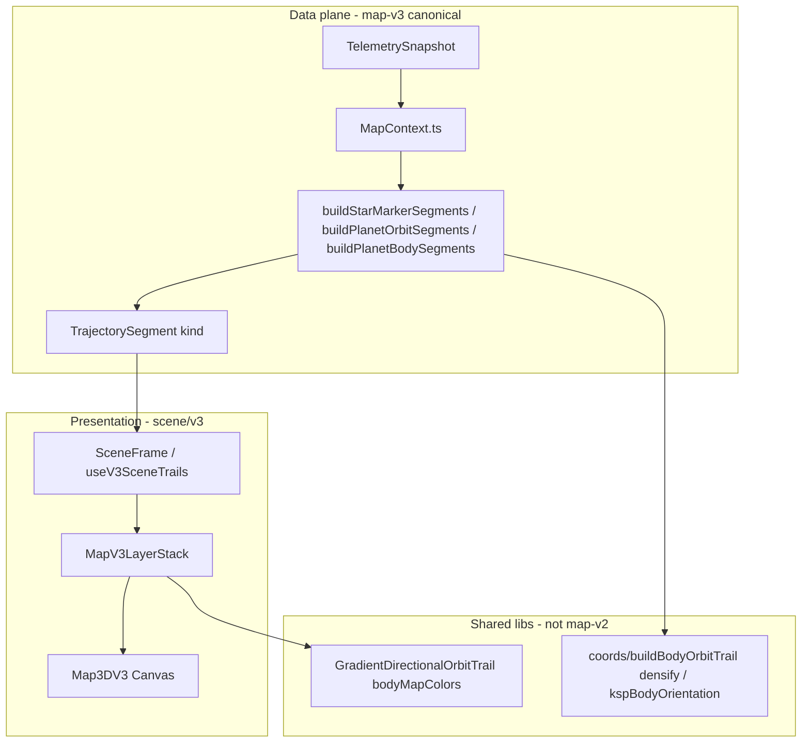

# Map V3 — Program state (as-built)

**Revision:** 2026-05-26 (Phase 4 — moon orbits)

**Operator hub:** [`MAP_V3_PHASE3_GUIDE.md`](MAP_V3_PHASE3_GUIDE.md)

---

## Executive summary

| Phase | Status |
|-------|--------|
| 0 — Blank canvas | Complete |
| 1 — Star marker | Complete |
| 2 — Planet orbits | Complete — motion tail, samples-first, 128 DLL / 512 web verts, unified Sun-child `getRelativePositionAtUT` ([`HELIOCENTRIC_ORBIT_FRAME.md`](HELIOCENTRIC_ORBIT_FRAME.md)) |
| 3.1 — Planet bodies | Complete — mesh/icon LOD |
| 3.3 — Planet textures | Complete — plugin ScaledSpace export + HTTP JPEG ([`MAP_V3_PLANET_BODY_TEXTURE_SPEC.md`](MAP_V3_PLANET_BODY_TEXTURE_SPEC.md)) |
| 3.4 — Planet tilt and spin | Complete — schema v10, oriented mesh LOD ([`MAP_V3_PLANET_BODY_ORIENTATION_SPEC.md`](MAP_V3_PLANET_BODY_ORIENTATION_SPEC.md)) |
| 4 — Moon orbits | Complete — mesh-gated visibility, v3-native element ([`MAP_V3_MOON_ORBIT_SPEC.md`](MAP_V3_MOON_ORBIT_SPEC.md)) |
| 5–12 | Not started (see [`MAP_V3_MODULES.md`](MAP_V3_MODULES.md)) |

- **Default view:** `solarRenderMode: "3d-v3"` in `web/src/store/viewStore.ts`.
- **New feature work** targets `map-v3/` + `scene/v3/` only; v1/v2 remain for regression.
- **V3 core decoupled from v2:** see [`MAP_V3_DECOUPLE_PLAN.md`](MAP_V3_DECOUPLE_PLAN.md).
- **Next:** Phase 5 `moonBody` — reuse mesh LOD gate from Phase 4.

---

## Architecture



**Legacy:** `map-v2/MapContext` and `map-v2/SceneFrame` re-export from `map-v3`. `map-v2/TrajectoryPlanner` serves **3d-v2** only.

---

## Element matrix

| Kind | Builder | Layer | Status |
|------|---------|-------|--------|
| `starMarker` | `buildStarMarkerSegments` | `StarMarkerLayer` | Shipped |
| `planetOrbit` | `buildPlanetOrbitSegments` (v3-native) | `PlanetOrbitLayer` → `OrbitTrailV3` | Shipped |
| `planetBody` | `buildPlanetBodySegments` | `PlanetBodyLayer` | Shipped (3.1 LOD + 3.3 textures + 3.4 orientation) |
| `moonOrbit` | `buildMoonOrbitSegments` | `MoonOrbitLayer` | Shipped (mesh-gated) |
| `moonBody` | — | `MoonBodyLayer` | Phase 5 |
| `vesselMarker` | — | `VesselMarkerLayer` | Phase 6 |
| `vesselOrbit` | — | `VesselOrbitLayer` | Phase 8 |
| `bodyLabel` | — | `BodyLabelLayer` | Phase 9 |
| `futureRoute` | — | `FutureRouteLayer` | Phase 10 |
| `soiRing` | — | `SoiLayer` | Phase 11 |
| `selection` | — | `SelectionLayer` | Phase 12 |

---

## V3 ownership vs shared code

| Owned by `map-v3/` | Shared (intentional) |
|--------------------|----------------------|
| `MapContext`, `SceneFrame`, `rootPointSafety` | `coords/*`, `telemetry/*`, `model/bodyHierarchy` |
| `planner/buildSegments`, element builders | `scene/GradientDirectionalOrbitTrail`, `orbitTrailDirectionStyle` |
| `filterHeliocentricPlanetOrbit`, `densifyPlanetOrbitTrail` | `scene/CameraRig`, `MoonVisibilityContext`, `viewStore` |
| `types`, `layerFlags`, `useMapV3Trails` | `scene/bodyMapColors`, `kspBodyMapColorTable` |
| `planetBodyOrientationFields`, texture field helpers | `coords/kspBodyOrientation.ts` (KSP ↔ Three + frame mapping) |

**Not used by V3:** `map-v2/TrajectoryPlanner` (v2 map modes only).

---

## Phase 3 summary (bodies + textures + orientation)

| Sub-phase | Deliverable |
|-----------|-------------|
| **3.1** | `buildPlanetBodySegments`, mesh/icon LOD (`planetBodyLod.ts`), `PlanetBodyDot` / `FlatPlanetBody` |
| **3.3** | `BodyTextureExportService` → `Web/assets/bodies/*.jpg`; `TexturedPlanetBody` + `planetBodyTextures.ts` (`flipY = true`) |
| **3.4** | `BodyOrientationResolver` (schema v10); `PlanetBodyOrientedGroup` + `PlanetBodyMeshPoleFrame`; dev spin axis |

**Pipeline (mesh LOD):**

```text
PlanetBodyLayer → PlanetBodyMesh
  → PlanetBodyOrientedGroup (body.rotation @ UT)
       → PlanetBodyMeshPoleFrame (sphere pole ↔ KSP north)
            → TexturedPlanetBody | FlatPlanetBody
```

**Dev tools:** planet texture lab (`planet-texture-lab.html`), LOD override, spin/tilt axis — see [`MAP_V3_PHASE3_GUIDE.md`](MAP_V3_PHASE3_GUIDE.md).

---

## Known debt / deferred (Phase 3+)

| Item | Notes |
|------|-------|
| **Texture longitude offset** | Flat JPEG on generic `SphereGeometry` can be ~10–30° off KSP tracking map longitude (P3R-01 partial). Fix later: `phiStart` or per-body meridian constant — see Phase 3 guide §13 |
| ~~**UT spin / texture spin**~~ | Longitude **flip-X at DLL export** (UI `128`). Spin: stock `rotationPeriod` sign + inertial north extrapolation (UI `131`); `KSP_TO_MESH_SIDEREAL_SPIN_SIGN` for Three basis |
| `rotationAngleRadians` | Exported; spin rate sign derived from `rotationPeriod` / `inverseRotation` (see `planetBodySiderealSpin.ts`) |
| In-game map debug lines | Not implemented (web dev axis only) |
| `MapV3LayerStack.tsx` | Manual layer list; dynamic registry deferred |
| Customize Map orbit highlight | Dev-only widen selected ring — refine or remove |
| Vessel orbits | Documented; not wired on V3 |
| `trailDrawSegments.ts` | Open-trail prototype, unused |
| Analytic planet rings | When &lt;2 samples; no `sampleUniversalTimes` on analytic paths |

---

## Orbit trail stack (phase 2 detail)

| Layer | Detail |
|-------|--------|
| Path filter | `filterHeliocentricPlanetOrbit.ts` (same rules as former v2 `BodyOrbit` + `planetOnly`) |
| Geometry | `resolvePlanetOrbitSourcePoints` → `densifyPlanetOrbitRootPoints` (**512** verts) |
| Capture | DLL **128** samples/period; Sun-children: parent-relative at all UTs |
| Drawer | `GradientDirectionalOrbitTrail` — one closed `Line`, motion tail |
| Colors | `kspBodyMapColorTable.ts` + Customize Map HUD |
| Docs | [`ORBIT_TRAIL_DRAWING_GUIDE.md`](ORBIT_TRAIL_DRAWING_GUIDE.md), [`HELIOCENTRIC_ORBIT_FRAME.md`](HELIOCENTRIC_ORBIT_FRAME.md), [`PLANET_ORBIT_COLOR_GUIDE.md`](PLANET_ORBIT_COLOR_GUIDE.md) |

---

## Verification baseline

| Check | Value |
|-------|--------|
| Tests | `npm test` — 106+ (planet body, orientation, textures, composer) |
| Web build | `npm run build` green |
| UI version | `128-body-texture-export-flipx` (`web/src/mount.tsx`; hard-refresh `?v=128`) |
| HUD label | `v3 phase 4 — moon orbits` (`MAP_V3_PHASE_LABEL` in `layerFlags.ts`) |
| Telemetry schema | **v10** (`bodyOrientationRootRelative`, texture fields on schema v9+) |
| DLL frame revision | `frameDiagnostics.resolverVersion` `"6"` (Sun-child + moon trail + moon icon propagation — not “Map V4”) |
| Manual acceptance | [`MAP_V3_ACCEPTANCE.md`](MAP_V3_ACCEPTANCE.md) § Phase 3.1, 3.3, 3.4 |
| Telemetry script | `scripts/verify-telemetry.ps1` (textures + orientation tables) |
| Decouple record | [`MAP_V3_DECOUPLE_PLAN.md`](MAP_V3_DECOUPLE_PLAN.md) |

---

## Forward path

**Phase 4** ships `moonOrbit` with visibility tied to [`PlanetBodyMeshLodContext`](../web/src/map-v3/PlanetBodyMeshLodContext.tsx) (parent planet mesh LOD), not `MoonVisibilityContext` SOI rules.

**Moon orbit frame (2026-05-26):** Samples-first DLL geometry + `parent(now) + offset` placement only — same discipline as heliocentric planet rings. See [`MAP_V3_MOON_ORBIT_SPEC.md`](MAP_V3_MOON_ORBIT_SPEC.md) rev 1.2 and [`HELIOCENTRIC_ORBIT_FRAME.md`](HELIOCENTRIC_ORBIT_FRAME.md) § Moon trail rings.

**Phase 5** (`moonBody`) should reuse the same mesh gate.

Planet texture meridian alignment and in-game map overlays remain optional polish.
