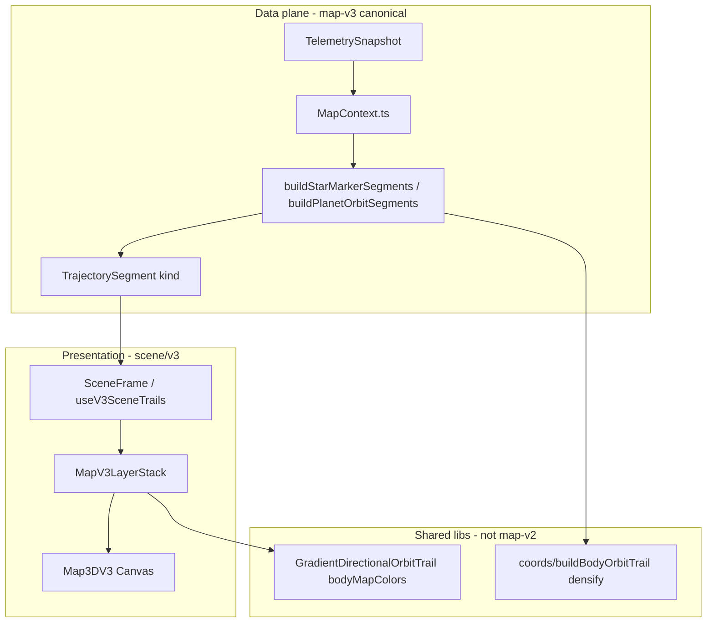

# Map V3 — Program state (as-built)

**Revision:** 2026-05-22 (phase 2 complete; heliocentric frame fix; V3 decoupled from v2 planner)

---

## Executive summary

| Phase | Status |
|-------|--------|
| 0 — Blank canvas | Complete |
| 1 — Star marker | Complete |
| 2 — Planet orbits | Complete — motion tail, samples-first, 128 DLL / 512 web verts, unified Sun-child `getRelativePositionAtUT` ([`HELIOCENTRIC_ORBIT_FRAME.md`](HELIOCENTRIC_ORBIT_FRAME.md)) |
| 3–12 | Not started (see [`MAP_V3_MODULES.md`](MAP_V3_MODULES.md)) |

- **Default view:** `solarRenderMode: "3d-v3"` in `web/src/store/viewStore.ts`.
- **New feature work** targets `map-v3/` + `scene/v3/` only; v1/v2 remain for regression.
- **V3 core decoupled from v2:** see [`MAP_V3_DECOUPLE_PLAN.md`](MAP_V3_DECOUPLE_PLAN.md).

---

## Architecture

**Legacy:** `map-v2/MapContext` and `map-v2/SceneFrame` re-export from `map-v3`. `map-v2/TrajectoryPlanner` serves **3d-v2** only.

---

## Element matrix

| Kind | Builder | Layer | Status |
|------|---------|-------|--------|
| `starMarker` | `buildStarMarkerSegments` | `StarMarkerLayer` | Shipped |
| `planetOrbit` | `buildPlanetOrbitSegments` (v3-native) | `PlanetOrbitLayer` → `OrbitTrailV3` | Shipped |
| `planetBody` | — | `PlanetBodyLayer` | Next — phase 3 |
| `moonOrbit` | — | `MoonOrbitLayer` | Phase 4 |
| `moonBody` | — | `MoonBodyLayer` | Phase 5 |
| `vesselMarker` | — | `VesselMarkerLayer` | Phase 6 |
| `vesselOrbit` | — | `VesselOrbitLayer` | Phase 8 |
| `bodyLabel` | — | `BodyLabelLayer` | Phase 9 |
| `futureRoute` | — | `FutureRouteLayer` | Phase 10 |
| `soiRing` | — | `SoiLayer` | Phase 11 |
| `selection` | — | `SelectionLayer` | Phase 12 |

---

## V3 ownership vs shared code

| Owned by `map-v3/` | Shared (intentional) |
|--------------------|----------------------|
| `MapContext`, `SceneFrame`, `rootPointSafety` | `coords/*`, `telemetry/*`, `model/bodyHierarchy` |
| `planner/buildSegments`, element builders | `scene/GradientDirectionalOrbitTrail`, `orbitTrailDirectionStyle` |
| `filterHeliocentricPlanetOrbit`, `densifyPlanetOrbitTrail` | `scene/CameraRig`, `MoonVisibilityContext`, `viewStore` |
| `types`, `layerFlags`, `useMapV3Trails` | `scene/bodyMapColors`, `kspBodyMapColorTable` |

**Not used by V3:** `map-v2/TrajectoryPlanner` (v2 map modes only).

---

## Known debt / intentional shortcuts

| Item | Notes |
|------|-------|
| `MapV3LayerStack.tsx` | Manual layer list; dynamic registry deferred |
| Customize Map orbit highlight | Widen selected ring in dev mode — remove or refine (see commit TODO) |
| Vessel orbits | Documented in orbit guide; not wired on V3 |
| `trailDrawSegments.ts` | Open-trail prototype, unused |
| Analytic planet rings | When &lt;2 samples; no `sampleUniversalTimes` on analytic paths |

---

## Orbit trail stack (phase 2 detail)

| Layer | Detail |
|-------|--------|
| Path filter | `filterHeliocentricPlanetOrbit.ts` (same rules as former v2 `BodyOrbit` + `planetOnly`) |
| Geometry | `resolvePlanetOrbitSourcePoints` → `densifyPlanetOrbitRootPoints` (**512** verts) |
| Capture | DLL **128** samples/period; Sun-children: parent-relative at all UTs |
| Drawer | `GradientDirectionalOrbitTrail` — one closed `Line`, motion tail |
| Colors | `kspBodyMapColorTable.ts` + Customize Map HUD |
| Docs | [`ORBIT_TRAIL_DRAWING_GUIDE.md`](ORBIT_TRAIL_DRAWING_GUIDE.md), [`HELIOCENTRIC_ORBIT_FRAME.md`](HELIOCENTRIC_ORBIT_FRAME.md), [`PLANET_ORBIT_COLOR_GUIDE.md`](PLANET_ORBIT_COLOR_GUIDE.md) |

---

## Forward path

Phase 3 (`planetBody`): new `map-v3/elements/planetBody/buildPlanetBodySegments` — follow [`MAP_V3_MODULES.md`](MAP_V3_MODULES.md) procedure; do not import v2 `TrajectoryPlanner`.

---

## Verification baseline

- `npm test` / `npm run build` green (72 tests).
- UI version: `94-heliocentric-relative-unified` (`web/src/mount.tsx`; refresh `?v=94`).
- DLL `frameDiagnostics.resolverVersion`: `"4"` (frame authority — not “Map V4”).
- Manual: [`MAP_V3_ACCEPTANCE.md`](MAP_V3_ACCEPTANCE.md) phase 2.
- Decouple record: [`MAP_V3_DECOUPLE_PLAN.md`](MAP_V3_DECOUPLE_PLAN.md).
