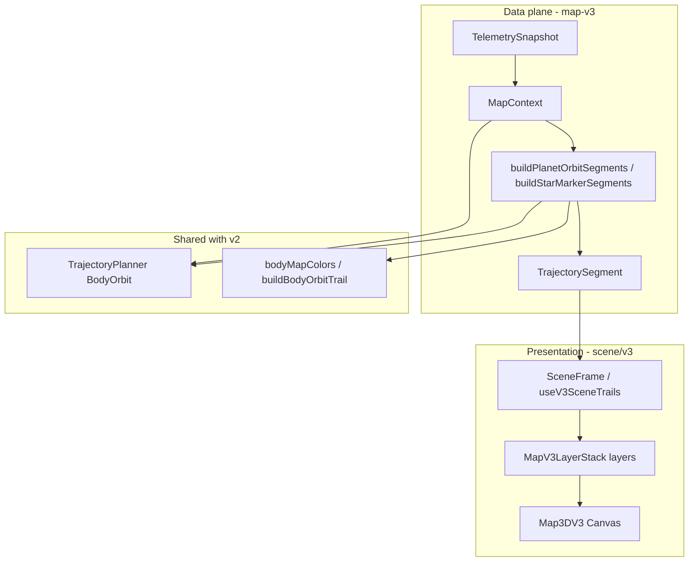

# Map V3 — Program state (as-built)

**Revision:** 2026-05-21 (phase 2 complete: motion tail, samples-first geometry, 128→512 orbit density)

---

## Executive summary

| Phase | Status |
|-------|--------|
| 0 — Blank canvas | Complete |
| 1 — Star marker | Complete |
| 2 — Planet orbits | Complete — motion tail, KSP-aligned sample geometry, 128 DLL / 512 web verts (`85-orbit-128-samples`) |
| 3–12 | Not started (see [`MAP_V3_MODULES.md`](MAP_V3_MODULES.md)) |

- **Default view:** `solarRenderMode: "3d-v3"` in `web/src/store/viewStore.ts`.
- **New feature work** targets V3 paths; v1/v2 remain for regression only.

---

## Architecture

---

## Element matrix

| Kind | Builder | Layer | Status |
|------|---------|-------|--------|
| `starMarker` | `buildStarMarkerSegments` | `StarMarkerLayer` | Shipped |
| `planetOrbit` | `buildPlanetOrbitSegments` | `PlanetOrbitLayer` → `OrbitTrailV3` | Shipped |
| `planetBody` | — | `PlanetBodyLayer` | Planned phase 3 |
| `moonOrbit` | — | `MoonOrbitLayer` | Phase 4 |
| `moonBody` | — | `MoonBodyLayer` | Phase 5 |
| `vesselMarker` | — | `VesselMarkerLayer` | Phase 6 |
| `vesselOrbit` | — | `VesselOrbitLayer` | Phase 8 |
| `bodyLabel` | — | `BodyLabelLayer` | Phase 9 |
| `futureRoute` | — | `FutureRouteLayer` | Phase 10 |
| `soiRing` | — | `SoiRingLayer` | Phase 11 |
| `selection` | — | `SelectionLayer` | Phase 12 |

---

## Shared dependencies on v2

| V2 module | V3 usage |
|-----------|----------|
| `map-v2/MapContext.ts` | `buildMapContext` (phase 0–2) |
| `map-v2/TrajectoryPlanner` `BodyOrbit` | Planner segments; v3 replaces points via `resolvePlanetOrbitSourcePoints` |
| `map-v2/SceneFrame` | Re-exported / reused for `toScenePoints` |
| `coords/buildBodyOrbitTrail.ts` | Analytic fallback, `resolveTrailRenderMode` |
| `scene/GradientDirectionalOrbitTrail.tsx` | Shared trail drawer (not v3-exclusive) |

---

## Known debt / intentional shortcuts

| Item | Notes |
|------|-------|
| `MapV3LayerStack.tsx` | Manual layer list; `composeMapV3Layers` used in tests/docs only — dynamic registry deferred |
| `planetBody` | Spec’d but not rendered (phase 3 blocked on orbit acceptance — orbits now aligned) |
| Vessel orbits | Documented in orbit guide; not wired to drawer |
| `trailDrawSegments.ts` | Open-trail prototype, unused in production |
| Analytic planet rings | Used only when &lt;2 samples; no `sampleUniversalTimes` on analytic paths |

---

## Orbit trail stack (phase 2 detail)

| Layer | Detail |
|-------|--------|
| Capture | DLL **128** samples/period; fraction `i/N`, no wrap at 1.0 |
| Geometry | Samples-first in `densifyPlanetOrbitTrail.ts` |
| Densify | Web **512** vertices (`planetOrbitStyle.trailVertices`) |
| Drawer | `GradientDirectionalOrbitTrail` — one closed `Line` for planet rings |
| Style | `opacityForOrbitTailAhead` — attach **1.0**, lead **0.25**, linear prograde ramp |
| Colors | `bodyMapColors.ts`; alpha-only fade |
| Docs | [`ORBIT_TRAIL_DRAWING_GUIDE.md`](ORBIT_TRAIL_DRAWING_GUIDE.md) §2 motion tail, **§12** vertex tuning |

---

## Forward path

Phases 3–12 follow [`MAP_V3_MODULES.md`](MAP_V3_MODULES.md) and phase plans (`MAP_V3_PHASE*_PLAN.md`). Each phase enables one `MapV3LayerFlags` group, adds `build*Segments`, layer TSX, rendering guide section, and acceptance rows.

---

## Verification baseline

- `npm test` / `npm run build` green.
- UI version: `KSP_WEB_MAP_UI_VERSION` in `web/src/mount.tsx` (currently `85-orbit-128-samples`).
- Manual: [`MAP_V3_ACCEPTANCE.md`](MAP_V3_ACCEPTANCE.md) phase 2 rows P2-01–P2-10.
- Flight scripts: [`BODY_ORBIT_VNV.md`](BODY_ORBIT_VNV.md).
