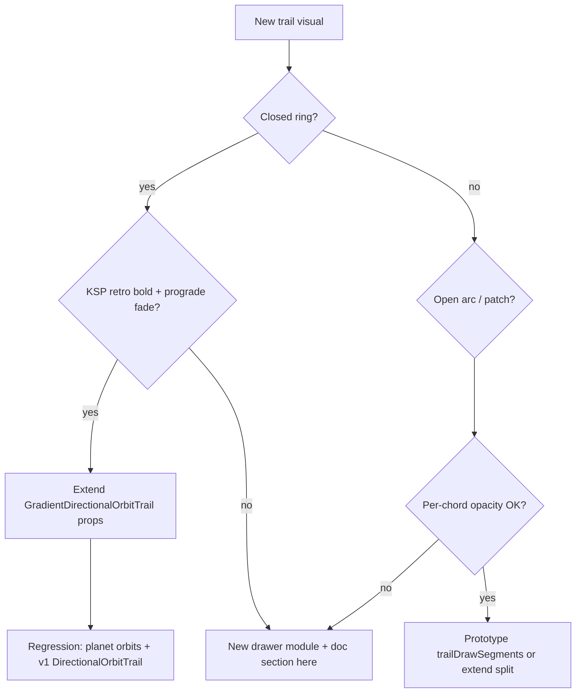

# Orbit trail drawing guide

**Document ID:** MAP-ORBIT-TRAIL-001  
**Audience:** Operators and developers extending KspWebMap solar-map trails  
**Canonical map:** Map V3 (`solarRenderMode: "3d-v3"`, default in `viewStore.ts`)

---

## 1. Purpose and scope

Orbit trails on the KSP in-game map use **body-anchored directional styling**: bold color at the planet (retrograde), faint color along the prograde half. This project centralizes that look in shared scene modules; V3 element builders only supply geometry, anchor index, optional per-vertex universal time (UT), and color.

| Responsibility | Location |
|----------------|----------|
| Telemetry → root polylines | `map-v3/elements/*Orbit*/build*Segments.ts` (+ v2 `TrajectoryPlanner` where reused) |
| Densify / analytic source | `densifyPlanetOrbitTrail.ts`, `coords/buildBodyOrbitTrail.ts` |
| Draw contract | `web/src/scene/GradientDirectionalOrbitTrail.tsx` |
| V3 wiring | `PlanetOrbitLayer` → `OrbitTrailV3` |

**Do not** add a second closed-ring drawer without following the decision tree in §8.

---

## 2. KSP reference behavior

- **Retrograde half** (from body backward along the trail): full stock body color, **uniform** opacity (`ORBIT_TRAIL_OPACITY_TRAILING` = 1.0).
- **Prograde half** (from body forward): same hue, **vertex alpha fade** from bold at the body to `ORBIT_TRAIL_OPACITY_PROGRADE_AT_ICON` (0.2) at the far end of the half-orbit.
- **Anchor** at the body icon on the ring (nearest vertex or UT-monotonic step).
- **Closed heliocentric planet rings** vs **open vessel patches** (future): same split logic; open arcs use `closedWithDuplicateEndpoint: false` and may use `trailDrawSegments` (prototype, not wired).

Compare side-by-side with in-game map and **3D WebGL (v1)** on the same flight.

---

## 3. Module catalog

| Module | Inputs | Outputs | When to use |
|--------|--------|---------|-------------|
| `GradientDirectionalOrbitTrail.tsx` | `points`, `anchorIndex`, `lineColor`, optional `sampleUniversalTimes` | Two `@react-three/drei` `Line`s | **Default** closed/open trails with KSP split + prograde gradient |
| `splitOrbitTrailHalves.ts` | points, anchor, closed flag, optional UT | `{ retrograde, prograde }` polylines | Used by drawer only; extend if half boundary logic changes |
| `orbitTrailDirectionStyle.ts` | counts, UT arrays | opacities, `resolveProgradeIndexStep`, `hexToRgbaVertexColors` | Tuning constants and UT-based prograde direction |
| `bodyMapColors.ts` | `bodyName` | hex string | Stock KSP palette (`getKspBodyMapColor`) |
| `densifyOrbitTrail.ts` | sparse polyline | 512-vertex ring | Arc-length resample; `densifySampleUniversalTimes` for UT |
| `densifyPlanetOrbitTrail.ts` | `MapContext`, path | 512 planet ring + optional UT | V3 planet-specific analytic preference |
| `coords/buildBodyOrbitTrail.ts` | `BodyOrbitPath` | analytic segments | Keplerian fallback when samples sparse |
| `trailDrawSegments.ts` | open trail + icon | per-chord opacity segments | **Prototype** for open paths; see file header |
| `DirectionalOrbitTrail.tsx` | same props | delegates to `GradientDirectionalOrbitTrail` | v1 compatibility wrapper |

**Removed (do not resurrect):** `planetOrbitRingHalves.ts`, `opacityForOrbitAheadKspRing`, `trailVertexOpacitiesKspRing` — full-ring vertex gradients washed out to a uniform ring.

---

## 4. Rendering pipeline

- **Primitive:** `@react-three/drei` `Line` (Line2 under the hood).
- **Retrograde:** `color={lineColor}`, `opacity={ORBIT_TRAIL_OPACITY_TRAILING}`, `transparent`, `toneMapped={false}`.
- **Prograde:** `color="#ffffff"`, `vertexColors` from `hexToRgbaVertexColors(lineColor, progradeHalfVertexOpacities(n))`, narrower `lineWidth`.
- **Canvas:** `Map3DV3` sets `THREE.NoToneMapping` on the renderer — prevents dimmed lines in the KSP CEF host.

---

## 5. Tuning knobs

| Constant / knob | File | Effect |
|-----------------|------|--------|
| `ORBIT_TRAIL_OPACITY_TRAILING` | `orbitTrailDirectionStyle.ts` | Retrograde line opacity (1.0) |
| `ORBIT_TRAIL_OPACITY_PROGRADE_AT_ICON` | same | Prograde far-end target (0.2) |
| `progradeHalfVertexOpacities(n)` | same | Smooth fade along prograde half only |
| `progradeLineWidthFactor` | `planetOrbitStyle.ts` / drawer prop | Prograde line width multiplier (0.7) |
| `PLANET_ORBIT_STYLE.trailVertices` | `planetOrbitStyle.ts` | Densify target (512) |
| `getKspBodyMapColor` | `bodyMapColors.ts` | Per-body hue |

---

## 6. Anchor and prograde direction

| Mechanism | Role |
|-----------|------|
| `anchorIndex` | Vertex nearest live body position on the closed ring |
| `sampleUniversalTimes` | When present (telemetry **samples** path, not analytic), `resolveProgradeIndexStep` uses UT monotonicity to pick +1 vs −1 index step |
| `findTrailAnchorOnPeriod` | Nearest vertex to icon for open/duplicate-endpoint trails |
| Analytic rings | No per-vertex UT; prograde step defaults from geometry |

V3 planet pipeline: `buildPlanetOrbitSegments` sets `sampleUniversalTimes` only when `resolvePlanetOrbitPointsFromPath` is **not** used (see `densifyPlanetOrbitTrail.ts`).

---

## 7. Failed approaches (appendix)

| Approach | Symptom | Why rejected |
|----------|---------|--------------|
| Full-ring cosine vertex opacity (`trailVertexOpacitiesKspRing`) | Entire ring looked one middling opacity | KSP uses **two halves**, not one wave around 360° |
| Brightness-only fade, alpha = 1 | Washed, no depth cue | KSP fades **alpha** on prograde half |
| Uniform half-opacity without vertex gradient | Visible seam, flat prograde | Prograde needs smooth vertex fade |
| `planetOrbitRingHalves` dense slices | Redundant with `splitOrbitTrailHalves` | Deleted |

---

## 8. Decision tree: extend drawer vs new module

**Extend** when: same two-half model, same Line/material rules, only data plumbing differs.  
**New module** when: different color model (dashed SOI, multi-band heatmap), non-polyline primitives, or pick/interaction tied to custom geometry.

---

## 9. Recipes

### 9.1 New closed body orbit (planet / moon)

1. Add `build*OrbitSegments` under `map-v3/elements/<kind>/`.
2. Densify to `PLANET_ORBIT_STYLE.trailVertices` (or moon style when added).
3. Set `anchorIndex` from `bodyByName` position.
4. Optionally set `sampleUniversalTimes` from `path.samples` when not analytic.
5. Layer: map trails → `<OrbitTrailV3 ... />` or pass props to `GradientDirectionalOrbitTrail`.
6. Update `MAP_V3_RENDERING_GUIDE.md` and acceptance IDs.

### 9.2 Wire existing drawer (already done for V3 planets)

`PlanetOrbitLayer` → `useV3RootSegments("planetOrbit")` → `useV3SceneTrails` → `OrbitTrailV3` → `GradientDirectionalOrbitTrail`.

### 9.3 Future vessel open arc (stub)

1. Build open `TrajectorySegment` (`closed: false`).
2. Pass `sampleUniversalTimes` from vessel root path samples.
3. Either extend `splitOrbitTrailHalves` for open geometry or finish `buildTrailDrawSegments` and a thin multi-`Line` wrapper.
4. Do **not** use removed full-ring helpers.

---

## 10. Verification

| Check | How |
|-------|-----|
| Unit | `npm test` — `orbitTrailDirectionStyle.test.ts`, `splitOrbitTrailHalves.test.ts`, `buildPlanetOrbitSegments.test.ts` |
| Build | `npm run build` |
| Visual | In-game vs **3D Map V3** — retro bold at planet, prograde fade visible |
| Deploy | `scripts/build.ps1` + `scripts/install.ps1`; confirm `window.KspSolarMapUiVersion` |
| Cache | `index.html` `?v=` matches bundle generation |

---

## Cross-links

- [`MAP_V3_PLANET_ORBIT_SPEC.md`](MAP_V3_PLANET_ORBIT_SPEC.md)
- [`MAP_V3_RENDERING_GUIDE.md`](MAP_V3_RENDERING_GUIDE.md) § Planet orbit
- [`MAP_V3_PROGRAM_STATE.md`](MAP_V3_PROGRAM_STATE.md)
