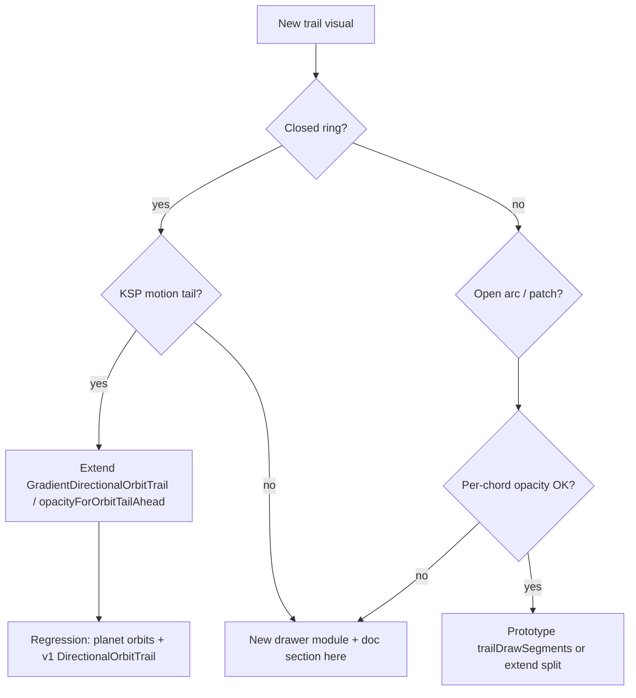

# Orbit trail drawing guide

**Document ID:** MAP-ORBIT-TRAIL-001  
**Revision:** 1.2 (2026-05-22) — §13 heliocentric frame; §12 vertex/sample tuning  
**Audience:** Operators and developers extending KspWebMap solar-map trails  
**Canonical map:** Map V3 (`solarRenderMode: "3d-v3"`, default in `viewStore.ts`)  
**UI reference build:** `94-heliocentric-relative-unified` (`KSP_WEB_MAP_UI_VERSION` in `web/src/mount.tsx`; hard-refresh `?v=94`)

**Orbit colors (stock table, Customize Map, mod packs):** [`PLANET_ORBIT_COLOR_GUIDE.md`](PLANET_ORBIT_COLOR_GUIDE.md)

---

## 1. Purpose and scope

Orbit trails on the KSP in-game map use **body-anchored directional styling** so you can read orbital motion without time warp: a **motion tail** on one closed ring (faint ahead, bold where the trail meets the body from behind). This project centralizes that look in shared scene modules; V3 element builders only supply geometry, anchor index, optional per-vertex universal time (UT), and color.

| Responsibility | Location |
|----------------|----------|
| Telemetry → root polylines | `map-v3/elements/*Orbit*/build*Segments.ts` (v3-native; see [`MAP_V3_DECOUPLE_PLAN.md`](MAP_V3_DECOUPLE_PLAN.md)) |
| Densify / analytic source | `densifyPlanetOrbitTrail.ts`, `coords/buildBodyOrbitTrail.ts` |
| Draw contract | `web/src/scene/GradientDirectionalOrbitTrail.tsx` |
| Opacity curve | `web/src/scene/orbitTrailDirectionStyle.ts` (`opacityForOrbitTailAhead`, `closedRingHalfGradientOpacities`) |
| V3 wiring | `PlanetOrbitLayer` → `OrbitTrailV3` |

**Do not** add a second closed-ring drawer without following the decision tree in §9.

---

## 2. Motion tail — how the gradient should look

This is the **intended visual** (matches stock KSP map direction cues and phase 2 acceptance). Think of a planet on its orbit as you watch it from the map:

1. **At the planet (anchor)** the line is **fully strong** — opacity **1.0**, same hue as the stock body color. This is the **trailing / retrograde attach** point: the “thick end” of the tail where the streak meets the body from behind.

2. **Immediately ahead in the direction of travel (prograde)** the line is **faint** — opacity **0.25** (`ORBIT_TRAIL_TAIL_LEAD`). A thin streak appears to **come out in front** of the planet.

3. **Following the orbit forward** (same direction the planet is moving), opacity **increases linearly** from **0.25** all the way around the ring until the path meets the **rear of the planet** again at **1.0**.

4. **Reading direction:** you can tell which way the body is orbiting **without fast-forwarding** — bold at the back of the motion, faint leading edge ahead, like a comet tail wrapped around the orbit.

**What this is not:**

- Not symmetric “bright at body, dim in the middle, bright at body” on both sides.
- Not two flat halves (retro all 1.0, prograde all 0.25) with a cliff at the antipode.
- Not a full-ring cosine wave (washes out to uniform gray).
- Not RGB dimming — hue stays fixed; only **alpha** changes (`hexToRgbaVertexColors`).

```text
        prograde (faint 0.25)
              ╭─────── rising opacity ───────╮
              ▼                               │
    [planet] ●━━━━━━━━━━━━━━━━━━━━━━━━━━━━━━━┛
         1.0 attach              linear ramp → 1.0 at rear
```

**Implementation:** one `@react-three/drei` `Line` on closed planet rings; per-vertex alpha from `opacityForOrbitTailAhead(ahead, n)` where `ahead` is arc steps **in prograde order** from the anchor (`resolveProgradeIndexStep` + UT when available).

---

## 3. KSP reference behavior

- **Trailing side (retrograde, at/just behind the body):** full stock body color, opacity **1.0**.
- **Leading side (prograde, ahead of the body):** same hue, opacity **0.25** at the first step forward, then **linear** increase along the orbit in the direction of motion until back to **1.0** at the body.
- **Anchor** at the body icon on the ring (nearest vertex; UT monotonicity picks prograde index step when samples exist).
- **Closed heliocentric planet rings:** single closed `Line` with vertex colors (not two separate arcs in production).
- **Open vessel patches** (future): split-trail fallback (`splitOrbitTrailHalves`) — retro half flat **1.0**, prograde half uses the same ramp on an estimated period.

Compare side-by-side with in-game map and **3D WebGL (v1)** on the same flight.

---

## 4. Module catalog

| Module | Inputs | Outputs | When to use |
|--------|--------|---------|-------------|
| `GradientDirectionalOrbitTrail.tsx` | `points`, `anchorIndex`, `lineColor`, optional `sampleUniversalTimes` | One closed `Line` (planets) or two `Line`s (fallback) | **Default** KSP motion tail |
| `orbitTrailDirectionStyle.ts` | counts, anchor, optional UT | `opacityForOrbitTailAhead`, `closedRingHalfGradientOpacities`, `hexToRgbaVertexColors` | Tuning tail attach/lead and prograde direction |
| `splitOrbitTrailHalves.ts` | points, anchor, closed flag, optional UT | `{ retrograde, prograde }` polylines | Fallback when `closedWithDuplicateEndpoint` or &lt;3 points |
| `bodyMapColors.ts` | `bodyName` | hex string | Stock + dev defaults (`getKspBodyMapColor` / `useKspBodyMapColor`); see [color guide](PLANET_ORBIT_COLOR_GUIDE.md) |
| `kspBodyMapColorTable.ts` | body name | `#rrggbb` | Shipped stock palette (edit for mod-pack releases) |
| `CustomizeMapDevPanel.tsx` | HUD | preview / **Set color** | In-flight tuning; [`PLANET_ORBIT_COLOR_GUIDE.md`](PLANET_ORBIT_COLOR_GUIDE.md) |
| `densifyOrbitTrail.ts` | sparse polyline | 512-vertex ring | Arc-length resample; `densifySampleUniversalTimes` for UT |
| `densifyPlanetOrbitTrail.ts` | `MapContext`, path | 512 planet ring + optional UT | V3 planet geometry: **telemetry samples first**, analytic fallback, densify |
| `coords/buildBodyOrbitTrail.ts` | `BodyOrbitPath` | analytic segments | Keplerian fallback when samples sparse |
| `trailDrawSegments.ts` | open trail + icon | per-chord opacity segments | **Prototype** for open paths; see file header |
| `DirectionalOrbitTrail.tsx` | same props | delegates to `GradientDirectionalOrbitTrail` | v1 compatibility wrapper |

**Removed (do not resurrect):** `planetOrbitRingHalves.ts`, `opacityForOrbitAheadKspRing`, `trailVertexOpacitiesKspRing` — full-ring symmetric vertex gradients washed out to a uniform ring.

---

## 5. Rendering pipeline


**Closed planet rings** (`closedWithDuplicateEndpoint: false`, ≥3 points):

- One `Line` with `closeRingPoints` (duplicate first vertex for Line2).
- `vertexColors` from `hexToRgbaVertexColors(lineColor, closedRingHalfGradientOpacities(n, anchor, UT))`.
- `color="#ffffff"`, `transparent`, `toneMapped={false}`.

**Fallback** (moons with duplicate endpoint, degenerate paths):

- Two `Line`s via `splitOrbitTrailHalves`: retro `retrogradeHalfVertexOpacities` (all **1.0**), prograde `progradeHalfVertexOpacities` (tail ramp).

**Canvas:** `Map3DV3` sets `THREE.NoToneMapping` on the renderer — prevents dimmed lines blowing out or washing in the KSP CEF host.

---

## 6. Tuning knobs

| Constant / function | File | Effect |
|---------------------|------|--------|
| `ORBIT_TRAIL_TAIL_ATTACH` | `orbitTrailDirectionStyle.ts` | Opacity at body / trailing attach (**1.0**) |
| `ORBIT_TRAIL_TAIL_LEAD` | same | Opacity one prograde step ahead of body (**0.25**) |
| `opacityForOrbitTailAhead(ahead, n)` | same | Linear ramp: `ahead=0` → 1.0, `ahead=1` → 0.25, `ahead=n-1` → 1.0 |
| `closedRingHalfGradientOpacities` | same | Per-vertex opacities on closed ring using prograde `ahead` |
| `resolveProgradeIndexStep` | same | +1 / −1 along ring from UT or default |
| `progradeLineWidthFactor` | `planetOrbitStyle.ts` / drawer prop | Prograde line width on **split** fallback only (0.7) |
| `PLANET_ORBIT_STYLE.trailVertices` | `planetOrbitStyle.ts` | Web densify target (**512** draw vertices) |
| `BodyOrbitPathSampleCount` | `TelemetrySnapshotService.cs` | DLL samples per period (**128**; was 48) |
| `getKspBodyMapColor` | `bodyMapColors.ts` | Per-body hue (stock table + optional dev defaults) |

**Changing sample or vertex counts:** see **§12** (full procedure).

Aliases for tests/legacy: `ORBIT_TRAIL_HALF_RETRO_BODY` = `TAIL_ATTACH`, `ORBIT_TRAIL_HALF_PROGRADE_FAR` = `TAIL_LEAD`.

---

## 7. Anchor and prograde direction

| Mechanism | Role |
|-----------|------|
| `anchorIndex` | Vertex nearest live body position on the closed ring |
| `sampleUniversalTimes` | When present (telemetry **samples** path, not analytic), `resolveProgradeIndexStep` uses UT monotonicity to pick +1 vs −1 index step |
| `findTrailAnchorOnPeriod` | Nearest vertex to icon for open/duplicate-endpoint trails |
| Analytic rings | No per-vertex UT; prograde step defaults from geometry (+1) |

V3 planet pipeline: `buildPlanetOrbitSegments` sets `sampleUniversalTimes` when `planetOrbitTrailUsesAnalyticSource(path)` is **false** (≥2 telemetry samples and `trailRenderMode` ≠ `hidden`). Analytic-only rings omit UT; prograde step defaults to +1 along the ring.

**If the faint streak appears on the wrong side:** check anchor index and UT order first; invert is controlled by `resolveProgradeIndexStep`, not by mirroring opacity around the ring.

---

## 8. Failed approaches (appendix)

| Approach | Symptom | Why rejected |
|----------|---------|--------------|
| Full-ring cosine vertex opacity (`trailVertexOpacitiesKspRing`) | Entire ring one middling opacity | Symmetric wave; not a directional tail |
| Brightness-only fade, alpha = 1 | Washed, milky | KSP fades **alpha**, fixed hue |
| Symmetric 1.0 → faint → 1.0 with smoothstep at antipode | Looked like two zones, weak direction cue | Tail must stay **faint only ahead**, bold on trailing arc |
| Retro half flat 1.0 + prograde half flat dim | Obvious seam at antipode | Replaced by single-ring linear tail ramp |
| Retro arc ramping 0.34 → 1.0 (v77–v80 experiments) | Retro looked dim mid-orbit | User intent: retro = **no dimming** except via shared ramp back to attach |
| `planetOrbitRingHalves` dense slices | Redundant with `splitOrbitTrailHalves` | Deleted |

---

## 9. Decision tree: extend drawer vs new module



**Extend** when: same motion-tail model, same Line/material rules, only data plumbing differs.  
**New module** when: different color model (dashed SOI, heatmap), non-polyline primitives, or pick tied to custom geometry.

---

## 10. Recipes

### 10.1 New closed body orbit (planet / moon)

1. Add `build*OrbitSegments` under `map-v3/elements/<kind>/`.
2. Densify to `PLANET_ORBIT_STYLE.trailVertices` (or moon style when added).
3. Set `anchorIndex` from `bodyByName` position.
4. Optionally set `sampleUniversalTimes` from `path.samples` when not analytic.
5. Layer: map trails → `<OrbitTrailV3 ... />` or pass props to `GradientDirectionalOrbitTrail`.
6. Update `MAP_V3_RENDERING_GUIDE.md` and acceptance IDs.

### 10.2 Wire existing drawer (V3 planets)

`PlanetOrbitLayer` → `useV3RootSegments("planetOrbit")` → `useV3SceneTrails` → `OrbitTrailV3` → `GradientDirectionalOrbitTrail` (single ring).

### 10.3 Future vessel open arc (stub)

1. Build open `TrajectorySegment` (`closed: false`).
2. Pass `sampleUniversalTimes` from vessel root path samples.
3. Either extend `splitOrbitTrailHalves` for open geometry or finish `buildTrailDrawSegments` and a thin multi-`Line` wrapper.
4. Do **not** use removed full-ring helpers.

---

## 11. Verification

| Check | How |
|-------|-----|
| Unit | `npm test` — `orbitTrailDirectionStyle.test.ts`, `splitOrbitTrailHalves.test.ts`, `buildPlanetOrbitSegments.test.ts`, `densifyPlanetOrbitTrail.test.ts` |
| Build | `npm run build` |
| Visual | In-game vs **3D Map V3** — faint prograde lead, bold trailing attach, direction obvious without time warp |
| Geometry | `scripts/verify-telemetry.ps1` — `trailRenderMode: samples`, `liveToSample0` ≈ 0; icons on rings ([`BODY_ORBIT_VNV.md`](BODY_ORBIT_VNV.md)) |
| Deploy | `scripts/build.ps1` + `scripts/install.ps1`; confirm `window.KspSolarMapUiVersion` |
| Cache | `index.html` `?v=` matches bundle generation |

---

## 12. Orbit vertex and sample counts (tuning guide)

Planet orbit smoothness and KSP alignment depend on **two independent counts**. Do not confuse them.

| Stage | What it controls | Default | Where |
|-------|------------------|---------|--------|
| **A — DLL capture** | Points KSP propagates per orbit period in `bodyOrbitPaths[].samples` | **128** | `TelemetrySnapshotService.cs` → `BodyOrbitPathSampleCount` |
| **B — Web densify** | Vertices sent to the GPU after arc-length resample | **512** | `planetOrbitStyle.ts` → `PLANET_ORBIT_STYLE.trailVertices` (also `BODY_ORBIT_TRAIL_PERIOD_VERTICES` in `densifyOrbitTrail.ts` for shared helpers) |

```text
KSP flight scene
  └─ TelemetrySnapshotService: N samples (fraction i/N, never i=N)
       └─ JSON bodyOrbitPaths[].samples  (N ≈ 128)
            └─ resolvePlanetOrbitPointsFromPath: samples if ≥2 else analytic
                 └─ densifyPlanetOrbitRootPoints → 512 verts
                      └─ GradientDirectionalOrbitTrail (motion tail on 512)
```

### When to change which knob

| Symptom | Likely fix |
|---------|------------|
| Orbit looks like a **visible polygon** (faceted ring) but icons sit on the trail | Raise **A** (DLL samples). Web densify cannot invent curvature between sparse samples. |
| Ring is smooth but **jagged at extreme zoom** | Raise **B** (`trailVertices`) only. |
| Trail **offset from planet** (hundreds of Mm) with `trailRenderMode: samples` | **Geometry / frame**, not vertex count — samples-first (`densifyPlanetOrbitTrail.ts`); if `live↔s0≈0` but `live↔ana` is Gm, see **§13** / [`HELIOCENTRIC_ORBIT_FRAME.md`](HELIOCENTRIC_ORBIT_FRAME.md). |
| Inclination **~180° off** vs KSP; icon on ring at one point | **§13** mixed `live` + `getTruePositionAtUT` on Sun-child samples (DLL frame). |
| Motion tail on wrong side | **§7** anchor / UT — not sample count. |

**Tuning history (phase 2):** 48 DLL samples looked blocky after geometry was fixed; **128** DLL samples + **512** web densify is the current shipped pair (`85-orbit-128-samples`). Try **192** DLL before pushing DLL to 512.

### Procedure — change DLL sample count (stage A)

Requires a **new plugin DLL**; refreshing the browser alone is not enough.

1. Quit KSP.
2. Edit `src/KspWebMap/Telemetry/TelemetrySnapshotService.cs`:
   - `private const int BodyOrbitPathSampleCount = 128;` → your value (e.g. `192`).
   - Do **not** change `MaxBodyOrbitPathCount` (max **bodies** with paths, unrelated).
3. Optional: update comments in `web/src/map-v3/elements/planetOrbit/planetOrbitStyle.ts` and `web/src/scene/densifyOrbitTrail.ts` (`~128`) so docs match code.
4. `.\scripts\build.ps1` then `.\scripts\install.ps1` (see [`BUILD_AND_INSTALL.md`](BUILD_AND_INSTALL.md)).
5. Bump UI cache: `KSP_WEB_MAP_UI_VERSION` in `web/src/mount.tsx`, `?v=` in `GameData/KspWebMap/Web/index.html`, `npm run build`, copy web assets into `GameData/KspWebMap/Web` (build script / install path you normally use).
6. Start KSP → flight save → map `http://127.0.0.1:8750/?v=…` → hard refresh.
7. Verify: `GET /api/telemetry` → pick Kerbin (or any planet) → `bodyOrbitPaths[].samples.length` ≈ your count; `validation.trailRenderMode` should be `samples` on a stable save.

**Capture rule (do not remove):** samples use `fraction = i / BodyOrbitPathSampleCount` for `i = 0 … N-1`. The loop **never** uses `fraction = 1.0` (exact `UT + period`) because KSP orbit APIs misbehave at period wrap.

### Procedure — change web draw vertex count (stage B)

Web-only; no DLL rebuild if geometry source is unchanged.

1. Edit `web/src/map-v3/elements/planetOrbit/planetOrbitStyle.ts` → `trailVertices` (default **512**).
2. If other map modes should match, also set `BODY_ORBIT_TRAIL_PERIOD_VERTICES` in `web/src/scene/densifyOrbitTrail.ts` (used by v1/v2 densify helpers).
3. `cd web && npm test && npm run build`; stage/copy into `GameData/KspWebMap/Web`; bump `KSP_WEB_MAP_UI_VERSION` and `index.html` `?v=`.
4. Hard refresh map (KSP can stay running).

`densifyPlanetOrbitRootPoints` arc-length-resamples the closed ring to `trailVertices`. If input already has ≥ `trailVertices` points, it passes through without upsampling.

### Geometry source (must stay samples-first for planets)

V3 planet rings use `resolvePlanetOrbitPointsFromPath` / `resolvePlanetOrbitSourcePoints` in `densifyPlanetOrbitTrail.ts`:

1. If `validation.trailRenderMode === "hidden"` → skip (planner fallback).
2. If ≥ **2** sample positions in telemetry → use **samples** (matches v2 `bodyOrbitSegmentsForPath`).
3. Else if analytic elements valid → Kepler ring from `buildBodyOrbitTrailSegments`.
4. Else planner fallback points.

`planetOrbitTrailUsesAnalyticSource` mirrors (2) vs (3) for UT wiring in `buildPlanetOrbitSegments.ts`. **Do not** invert this order for “smoother” analytic rings when live telemetry disagrees by tens or hundreds of Mm.

### Quick reference — files touched by orbit density work

| Change type | Files |
|-------------|--------|
| DLL sample count | `TelemetrySnapshotService.cs` |
| Web densify target | `planetOrbitStyle.ts`, `densifyPlanetOrbitTrail.ts`, `densifyOrbitTrail.ts` |
| Geometry source | `densifyPlanetOrbitTrail.ts`, `coords/buildBodyOrbitTrail.ts` (`resolveTrailRenderMode`) |
| Segment assembly | `buildPlanetOrbitSegments.ts` |
| Draw | `GradientDirectionalOrbitTrail.tsx`, `orbitTrailDirectionStyle.ts` |
| Deploy / version | `mount.tsx`, `GameData/KspWebMap/Web/index.html` |

---

## 13. Heliocentric capture frame (inclination / plane)

**Full guide:** [`HELIOCENTRIC_ORBIT_FRAME.md`](HELIOCENTRIC_ORBIT_FRAME.md) — symptoms, postmortem, diagnostics, regression checklist.

**Rule:** Planets orbiting the Sun use **only** `orbit.getRelativePositionAtUT(UT)` for **all** DLL trail samples and display positions. The live shortcut (`body.position - root.position`) applies to **moons**, not Sun-children.

**Do not confuse versions:** Map **V3** is the product; `frameDiagnostics.resolverVersion` (e.g. `"4"`) is a DLL frame-revision tag in telemetry, not “Map V4.”

| Symptom | Action |
|---------|--------|
| `plane` in HUD QA &gt; 1° | Rebuild/install DLL; confirm `resolverVersion` `"4"`+; read helio frame doc |
| `live↔ana` in Gm, `live↔s0` ≈ 0 | Mixed-frame capture — fix resolver, not web inclination hack |
| `KSP.log` liveToAnalytic spam | Same |

---

## Cross-links

- [`HELIOCENTRIC_ORBIT_FRAME.md`](HELIOCENTRIC_ORBIT_FRAME.md) — Sun-child plane alignment (required reading for inclination bugs)
- [`MAP_V3_PLANET_ORBIT_SPEC.md`](MAP_V3_PLANET_ORBIT_SPEC.md) — inclusion, geometry source, acceptance
- [`MAP_V3_RENDERING_GUIDE.md`](MAP_V3_RENDERING_GUIDE.md) § Planet orbit
- [`MAP_V3_PROGRAM_STATE.md`](MAP_V3_PROGRAM_STATE.md)
- [`BODY_ORBIT_VNV.md`](BODY_ORBIT_VNV.md) — alignment QA and `verify-telemetry.ps1`
